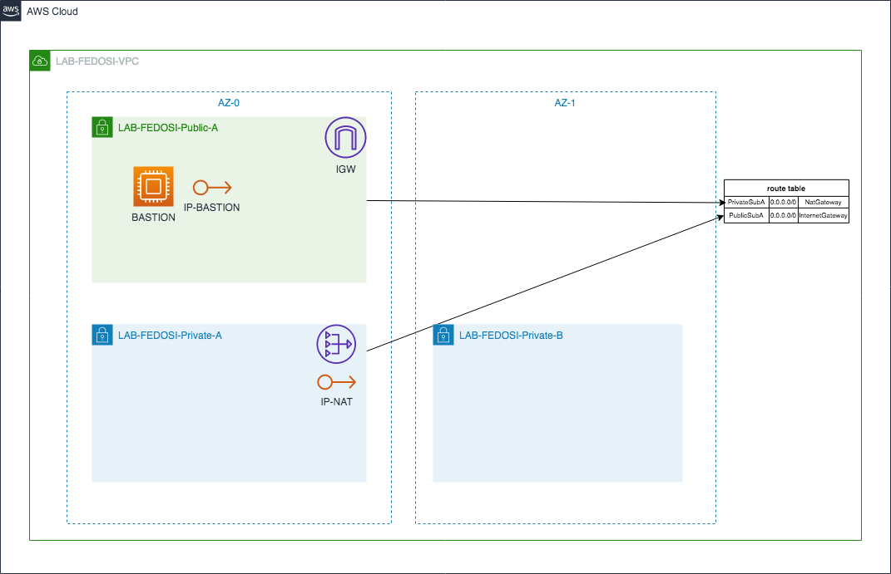

# cloudformation

### STACK DO LAB:



### APLICAR O CF:

**Validar o YAML:**
```Shell
aws --profile AWS-FEDOSI cloudformation validate-template --template-body file://./bastion.yaml
```

**Criar a stack:**
```Shell
aws --profile AWS-FEDOSI cloudformation create-stack --stack-name EC2-BASTION --template-body file://./bastion.yml
```

**Deletar a stack:**
```Shell
aws --profile AWS-FEDOSI cloudformation delete-stack --stack-name LAB-FEDOSI
```